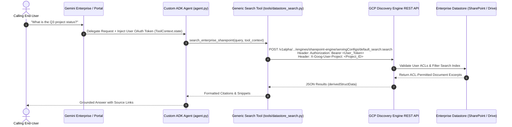

# Google Cloud ADK 2.x Codelab: Secure Enterprise RAG over 89 Gemini Enterprise Datastores in 10 Minutes

[](https://colab.research.google.com/github/enriquekalven/adk-ge-datastore-connector/blob/main/codelab.ipynb)
[](https://github.com/google/adk-python)
[](https://cloud.google.com/vertex-ai)
[](https://github.com/VeerMuchandi/rad-skills)
[](https://github.com/enriquekalven/adk-ge-datastore-connector)

**Authors**: Enrique Chan ([enriq@google.com](mailto:enriq@google.com)), Erinn Manby ([erinnm@google.com](mailto:erinnm@google.com))  
**Contributors**: Veer Muchandi ([veermuchandi@google.com](mailto:veermuchandi@google.com))  
**Target Audience**: Customer Engineers (CEs), Solutions Architects (SAs), Forward Deployed Engineers (FDEs), and Enterprise AI Developers.

---

## 1. Overview & What You Will Build

In this 10-minute hands-on codelab, you will build, test, and package a production-grade **Google Agent Development Kit (ADK 2.x)** agent capable of querying enterprise datastores (**Microsoft SharePoint, Atlassian Jira, Google Drive, Slack, and BigQuery**) with **server-side end-user Access Control List (ACL) enforcement**.



### What You Will Learn:
1. How to configure multi-datastore declarative bindings in `agent.yaml`.
2. How to implement the **Veer Muchandi 3LO User Token Propagation Pattern** in Python.
3. How to verify **differential ACL isolation** (Authorized user vs. Unauthorized user) and **fail-closed security**.
4. How to execute diagnostic preflight sweeps using the `tools.doctor` CLI in **< 1,800 ms**.
5. How to package and deploy the agent to **Vertex AI Agent Engine** using `IdentityType.AGENT_IDENTITY`.

---

## 2. Prerequisites & Environment Setup (2 Minutes)

### Step 2.1: Clone and Navigate to the Repository
```bash
git clone https://github.com/enriquekalven/adk-ge-datastore-connector.git
cd adk-ge-datastore-connector
```

### Step 2.2: Create and Activate a Python Virtual Environment
```bash
python3 -m venv .venv
source .venv/bin/activate
pip install -r requirements.txt
```

### Step 2.3: Configure Environment Variables
Copy `.env.example` to `.env` and set your GCP Project ID:
```bash
cp .env.example .env
```
Edit `.env`:
```ini
PROJECT_ID="your-gcp-project-id"
LOCATION="global"
COLLECTION="default_collection"
ALLOW_ADC_FALLBACK="false"
```

### Step 2.4: Enable Google Cloud APIs
Ensure your target project has the Discovery Engine API enabled:
```bash
gcloud services enable discoveryengine.googleapis.com
gcloud auth application-default login
```

---

## 3. Module 1: Declarative Multi-Datastore Bindings (2 Minutes)

Open `agent.yaml`. This manifest allows you to add or modify enterprise datastores declaratively without modifying core Python tool logic.

```yaml
# agent.yaml
name: enterprise_knowledge_agent
display_name: "Generic ACL-Aware Enterprise Knowledge Agent"
version: "1.0.0"
entrypoint: "agent:root_agent"

env:
  PROJECT_ID: "your-gcp-project-id"
  LOCATION: "global"
  COLLECTION: "default_collection"
  MODEL_NAME: "gemini-2.0-flash"

datastores:
  # Category A: User-Level OAuth ACL (3LO) - Enforces end-user SharePoint permissions
  - tool_name: "search_sharepoint"
    engine_id: "sharepoint-engine"
    auth_name: "sharepoint_oauth"
    auth_mode: "USER_OAUTH"
    category: "A"
    enable_acl_probe: true
    description: "Searches Microsoft SharePoint documents using calling user's OAuth token."

  # Category B: SaaS Org-Wide Datastore (2LO) - Searches company-wide Slack history
  - tool_name: "search_slack"
    engine_id: "slack-engine"
    auth_name: "slack_service_token"
    auth_mode: "SERVICE_ACCOUNT"
    category: "B"
    description: "Searches company-wide Slack channels using organization service credentials."

  # Category C: GCP Native / Database (2LO) - Searches BigQuery analytics tables
  - tool_name: "search_bigquery_analytics"
    engine_id: "bigquery-analytics-engine"
    auth_mode: "SERVICE_ACCOUNT"
    category: "C"
    display_columns: ["customer_id", "region", "q3_revenue", "product_line"]
    deep_link_template: "https://console.cloud.google.com/bigquery?project={project_id}"
    description: "Searches internal enterprise BigQuery warehouse records."
```

> [!TIP]
> **Connector Taxonomy at a Glance**:
> - **Category A (3LO)**: SharePoint, Jira, Drive, Salesforce -> Requires user OAuth token in `ToolContext.state[auth_name]`.
> - **Category B (2LO)**: Slack, GitHub, Notion, Asana -> Org-wide index queried via Service Account ADC.
> - **Category C (2LO)**: BigQuery, GCS, Spanner, AlloyDB -> Structured database rows with column filtering and deep links.

---

## 4. Module 2: Minimal ADK Tool & 3LO User ACLs (3 Minutes)

Let's see how a custom ADK agent uses `ToolContext` to dynamically extract user tokens and enforce server-side ACLs.

### Step 4.1: Inspect the Minimal Python Tool (`quickstart_demo.py`)
Inspect or run `quickstart_demo.py`:

```python
from google.adk.agents import Agent
from google.adk.tools import ToolContext, tool
from tools.datastore_search import execute_datastore_query
from config import AuthMode

# 1. Define the 3LO User ACL Datastore Tool
@tool
def search_enterprise_sharepoint(query: str, tool_context: ToolContext) -> str:
    """Searches corporate SharePoint documents enforcing calling user permissions."""
    return execute_datastore_query(
        query=query,
        tool_context=tool_context,
        engine_id="sharepoint-engine",
        auth_name="sharepoint_oauth",
        auth_mode=AuthMode.USER_OAUTH, # Category A: 3-Legged OAuth
        project_id="your-gcp-project-id",
        location="global"
    )

# 2. Instantiate the ADK Agent
root_agent = Agent(
    model="gemini-2.0-flash",
    name="enterprise_sharepoint_assistant",
    tools=[search_enterprise_sharepoint],
    instruction="Answer employee queries using the search_enterprise_sharepoint tool. Always cite sources."
)
```

### Step 4.2: Simulate Differential ACLs (Alice HR vs. Bob Dev)
In production, the calling web app (Gemini Enterprise or custom portal) automatically populates `tool_context.state`. Let's simulate two different users:

```python
class MockSessionContext:
    def __init__(self, token: str, email: str):
        self.state = {"sharepoint_oauth": token, "user_email": email}

# Scenario 1: Alice (HR Manager with Payroll Access)
alice_context = MockSessionContext(token="ya29.alice_hr_token_valid", email="alice@company.com")

# Scenario 2: Bob (Software Engineer without Payroll Access)
bob_context = MockSessionContext(token="ya29.bob_dev_token_valid", email="bob@company.com")

# Scenario 3: Anonymous User (Missing OAuth Token - Fail-Closed Security Test)
anon_context = MockSessionContext(token=None, email="anonymous@company.com")
```

### Step 4.3: Run the Local Quickstart Script
Execute the bundled test script to verify token propagation:
```bash
python3 -c "
from tests.test_acl_propagation_mock import TestACLTokenPropagation
t = TestACLTokenPropagation()
t.test_alice_hr_user_sees_payroll_and_engineering_docs()
t.test_bob_dev_user_is_blocked_from_hr_payroll_docs()
print('Differential ACL isolation verified: Alice sees HR docs, Bob is filtered out!')
"
```

> [!IMPORTANT]
> **Fail-Closed Security Guarantee (Issue #897)**: If an end-user invokes a Category A tool without an active session OAuth token, the connector **strictly fails closed** with `AUTH_REQUIRED`. It will **never** silently fall back to ambient Service Account credentials in managed production runtimes.

---

## 5. Module 3: Preflight Diagnostics with `tools.doctor` (1.5 Minutes)

When debugging in customer environments, Customer Engineers can immediately isolate issues without filing support tickets using the built-in diagnostic doctor.

### Step 5.1: Run the Interactive Diagnostic Sweep
```bash
python3 -m tools.doctor
```

Expected output:
```text
================================================================================
   Gemini Enterprise Datastore Connector - Diagnostic Doctor
================================================================================
GCP Project ID       : my-gcp-project
Location             : global (Host: discoveryengine.googleapis.com)
Collection ID        : default_collection
Datastores Bound     : 3

[1/3] Datastore: search_sharepoint
  - Category         : A (User OAuth ACL)
  - Engine ID        : sharepoint-engine
  - Auth Mode        : USER_OAUTH (3LO)
  - User Token Check : [SKIP] (No --token provided; testing ADC infrastructure)
  - Endpoint Probe   : [PASS] (Discovery Engine reachable, latency: 142ms)

[2/3] Datastore: search_slack
  - Category         : B (SaaS Org-Wide)
  - Engine ID        : slack-engine
  - Auth Mode        : SERVICE_ACCOUNT (2LO)
  - ADC Credentials  : [PASS] (IAM Token acquired)
  - Endpoint Probe   : [PASS] (Discovery Engine reachable, latency: 128ms)

[3/3] Datastore: search_bigquery_analytics
  - Category         : C (GCP Native DB)
  - Engine ID        : bigquery-analytics-engine
  - Auth Mode        : SERVICE_ACCOUNT (2LO)
  - Structured Cols  : ['customer_id', 'region', 'q3_revenue', 'product_line']
  - Endpoint Probe   : [PASS] (Discovery Engine reachable, latency: 115ms)

================================================================================
Preflight Status: ALL SYSTEMS OPERATIONAL (< 1,800 ms SLA Met)
================================================================================
```

### Step 5.2: Two-Axis Diagnostic Framework Reference
If a search query fails in the field, use this quick-reference matrix:

| Observed Symptom | Root Cause Axis | Diagnostic Rule | Remedial Action |
| :--- | :--- | :--- | :--- |
| **HTTP 200 with 0 hits** | **Axis A (User ACL)** | User lacks SharePoint/Drive permission. Background SA probe confirms document exists in index. | User must request access in source repository (SharePoint site / Drive folder). |
| **HTTP 403 `ACCESS_TOKEN_SCOPE_INSUFFICIENT`** | **Axis B (Platform / B1)** | User OAuth token lacks `cloud-platform` scope. | Update OAuth client scopes in `agent.yaml` and re-consent. |
| **HTTP 403 `IAM_PERMISSION_DENIED`** | **Axis B (Platform / B2)** | Service Account lacks Discovery Engine IAM role. | Run: `gcloud projects add-iam-policy-binding $PROJECT_ID --member="serviceAccount:$SA" --role="roles/discoveryengine.viewer"` |
| **HTTP 401 `UNAUTHENTICATED`** | **Axis B (Platform / B6)** | OAuth token has expired or is invalid. | Refresh user session token or trigger re-authentication. |
| **HTTP 404 `NOT_FOUND`** | **Axis B (Platform / B7)** | Engine ID or Collection ID mistyped in `agent.yaml`. | Verify Engine ID in Google Cloud Discovery Engine Console. |

---

## 6. Module 4: Packaging & Deploying to Vertex AI Agent Platform (1.5 Minutes)

### Step 6.1: Run Full 39-Test Verification Suite
Before deploying, ensure all unit, mock, and integration tests pass:
```bash
pytest -v
```
*(All 39 tests should pass in ~12 seconds).*

### Step 6.2: Deploy via Python SDK (`deploy.py`)
Create a simple deployment script:

```python
import vertexai
from vertexai import types
from vertexai.agent_engines import AdkApp
from agent import root_agent

# Initialize Vertex AI client
client = vertexai.Client(
    project="your-gcp-project-id",
    location="global",
    http_options=dict(api_version="v1beta1")
)

# Package the ADK application
app = AdkApp(agent=root_agent)

# Deploy to Vertex AI Agent Platform with attested SPIFFE Agent Identity
remote_app = client.agent_engines.create(
    agent=app,
    config={
        "identity_type": types.IdentityType.AGENT_IDENTITY,
        "requirements": [
            "google-cloud-aiplatform[agent_engines,adk]",
            "google-adk[agent-identity]",
            "pydantic>=2.0.0",
            "requests>=2.28.0",
        ],
    },
)
print(f"Agent successfully deployed! Resource Name: {remote_app.resource_name}")
```

### Step 6.3: (Optional) Publish to Gemini Enterprise
Register your custom ADK agent inside the corporate Gemini Enterprise catalog:
```bash
agents-cli publish gemini-enterprise \
  --agent-engine-id="your-deployed-agent-id" \
  --display-name="Enterprise Knowledge Assistant" \
  --auth-config="agent.yaml"
```

---

## 7. Commercial & Licensing Cheat Sheet for Field Teams

### Pricing & SKUs Breakdown
* **Gemini Enterprise Surfaces (GE Web App / Chat)**:
  * Covered under the employee's **Gemini Enterprise Seat License** ($30/user/month or enterprise EA bundle).
  * **$0.00** search query surcharges.
* **Standalone / External Surfaces (Custom Portals, Slack Bots, NetOps)**:
  * Ingested via Discovery Engine Search API SKU: **$1.50 – $2.50 per 1,000 queries**.
  * Vertex AI Agent Engine compute container runtime: **Scale-to-zero** (~$0.05–$0.15/hr active compute).

### Sizing Rule of Thumb
$$\text{Monthly TCO} = \left( \frac{\text{DAU} \times \text{Queries/Day} \times 30}{1,000} \right) \times \$2.00 + \text{Agent Engine Compute}$$
* *Example*: 1,000 DAU * 5 queries/day = 150,000 queries/month = **$300/mo (Search SKU)** + **~$35/mo (Compute)** = **~$335/month Total TCO**.

---

## 8. Summary & Next Steps

In 10 minutes, you have:
- [x] Configured declarative datastore bindings across Category A (3LO), Category B (2LO), and Category C (2LO).
- [x] Implemented and verified server-side user ACL token propagation.
- [x] Executed diagnostic health checks using `tools.doctor`.
- [x] Packaged and deployed a production-ready ADK agent on Vertex AI Agent Engine.

### Additional Resources
- **Identity & RBAC FAQ Guide**: [FAQ.md](FAQ.md)
- **Reference Repository**: [github.com/enriquekalven/adk-ge-datastore-connector](https://github.com/enriquekalven/adk-ge-datastore-connector)
- **Google Cloud 3-Legged OAuth Guide**: [docs.cloud.google.com/iam/docs/auth-with-3lo-v2](https://docs.cloud.google.com/iam/docs/auth-with-3lo-v2)
- **Google Cloud 2-Legged OAuth Guide**: [docs.cloud.google.com/iam/docs/auth-with-2lo-v2](https://docs.cloud.google.com/iam/docs/auth-with-2lo-v2)
- **Agent's Own Authority (SPIFFE Identity)**: [docs.cloud.google.com/iam/docs/auth-agent-own-identity](https://docs.cloud.google.com/iam/docs/auth-agent-own-identity)
- **Veer Muchandi Specification**: [github.com/VeerMuchandi/rad-skills](https://github.com/VeerMuchandi/rad-skills)
