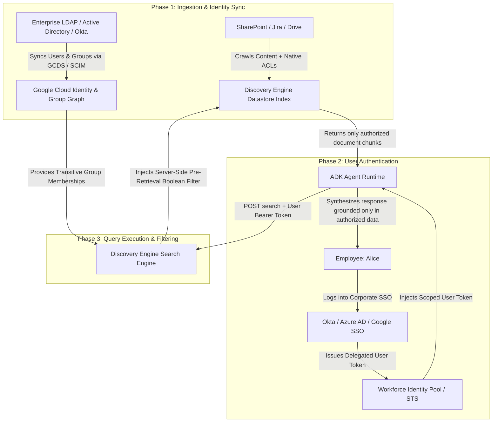

# Frequently Asked Questions (FAQ) & Identity Architecture Guide

[](https://github.com/google/adk-python)
[](https://cloud.google.com/vertex-ai)
[](https://github.com/VeerMuchandi/rad-skills)

This document addresses architectural, security, identity, and implementation questions regarding the Google Cloud Agent Development Kit (ADK 2.x) and Gemini Enterprise Datastore Connector integration.

---

## Table of Contents
1. [How does RBAC and ACL enforcement actually work?](#1-how-does-rbac-and-acl-enforcement-actually-work)
2. [If I use Google SSO, how does Google know my WIF, OIDC, or LDAP identity?](#2-if-i-use-google-sso-how-does-google-know-my-wif-oidc-or-ldap-identity)
3. [Does the LLM filter out unauthorized documents, or is it done server-side?](#3-does-the-llm-filter-out-unauthorized-documents-or-is-it-done-server-side)
4. [How are nested LDAP / Active Directory security groups handled?](#4-how-are-nested-ldap--active-directory-security-groups-handled)
5. [What is the difference between Category A, B, and C datastores?](#5-what-is-the-difference-between-category-a-b-and-c-datastores)
6. [What is Dual Token Sourcing and how does it work?](#6-what-is-dual-token-sourcing-and-how-does-it-work)
7. [What is the Fail-Closed defense and why is it critical?](#7-what-is-the-fail-closed-defense-and-why-is-it-critical)
8. [How does licensing and commercial billing work?](#8-how-does-licensing-and-commercial-billing-work)
9. [How do I troubleshoot Zero Hits vs. Access Denied?](#9-how-do-i-troubleshoot-zero-hits-vs-access-denied)

---

## 1. How does RBAC and ACL enforcement actually work?

To enforce native enterprise Access Control Lists (ACLs) dynamically at runtime, the platform coordinates across **three distinct phases**:



### The Three Phases in Detail:
1. **Ingestion Time (Document & ACL Mirroring):**
   When the Discovery Engine connector indexes a document (e.g., from SharePoint or Google Drive), it ingests both the content and the **native Access Control List (ACL)** attached to that file.
   * *Example:* `2026_Executive_Payroll.docx` is tagged with `ACL: { Allow: ["user:alice@company.com", "group:sg-exec-hr"] }`.
2. **Authentication Time (Token Acquisition):**
   When Alice logs into Gemini Enterprise or an ADK agent chat, her session captures her authenticated corporate identity (via Google SSO, Okta, or Azure AD) and injects her bearer token into `ToolContext.state["enterprise_oauth"]`.
3. **Query Time (Server-Side Boolean Filtering):**
   When the ADK tool sends Alice's query to Discovery Engine, it includes her bearer token in the `Authorization` header. Discovery Engine extracts Alice's verified email and group memberships and applies a **mandatory server-side filter** before vector similarity search or keyword retrieval occurs.

---

## 2. If I use Google SSO, how does Google know my WIF, OIDC, or LDAP identity?

Enterprises connect their corporate identity provider (IdP) to Google Cloud through one of two primary mechanisms:

```text
+-----------------------------------------------------------------------------------+
|                            ENTERPRISE IDENTITY FLOW                               |
+-----------------------------------------------------------------------------------+
|                                                                                   |
|  [On-Prem Active Directory / LDAP]                                               |
|               |                                                                   |
|               v (Continuous Directory Sync via GCDS)                             |
|  [Google Cloud Identity / Workspace Directory]                                    |
|               |                                                                   |
|               v (Native Google SSO Authentication)                               |
|  [ADK Agent Session] --(Bearer Token)--> [Discovery Engine Datastore]              |
|                                                  ^                                |
|                                                  | (Evaluates Group ACLs)         |
|  [Okta / Microsoft Entra ID (Azure AD)]          |                                |
|               |                                  |                                |
|               v (Workforce Identity Federation)  |                                |
|  [Google Cloud STS Token Exchange] --------------+                                |
|                                                                                   |
+-----------------------------------------------------------------------------------+
```

### Identity Ingestion & Federation Options:
1. **Google Cloud Directory Sync (GCDS) / Cloud Identity SCIM:**
   * Regularly synchronizes users, Organizational Units (OUs), and nested Active Directory / LDAP security groups directly into Google Cloud Identity.
   * Google knows all group memberships (`sg-finance`, `sg-executives`) associated with `alice@company.com`.
2. **Workforce Identity Federation (WIF) Attribute Mapping:**
   * If authenticating via an external OIDC or SAML 2.0 IdP (such as Okta, Ping, or Microsoft Entra ID), the IdP issues an assertion containing group claims.
   * Google STS maps these claims at token exchange time:
     ```yaml
     attribute_mapping:
       google.subject: "assertion.sub"
       attribute.email: "assertion.email"
       google.groups: "assertion.groups" # E.g., ["sg-hr", "sg-executives"]
     ```
3. **Third-Party SaaS Token Delegation (Salesforce / ServiceNow):**
   * The user performs a 3-legged OAuth consent flow with the downstream SaaS provider.
   * The agent forwards the user's personal SaaS access token, ensuring the downstream API enforces the user's specific role permissions.

---

## 3. Does the LLM filter out unauthorized documents, or is it done server-side?

**It is 100% enforced SERVER-SIDE by the search engine before chunks ever reach the LLM.**

* **No LLM Prompt Filtering:** The system does **not** rely on prompting the LLM (e.g., *"Please only show documents Alice is allowed to see"*). Such approaches are vulnerable to prompt injection and context window leakage.
* **Pre-Retrieval Filtering (Search Engine Core):**
  Discovery Engine injects a boolean predicate into the search index:
  $$\text{Match} = \text{VectorSearch}(\text{query}) \quad \mathbf{AND} \quad \Big( \text{Doc.ACL} \cap \text{Caller.Identities} \neq \emptyset \Big)$$
* If a junior engineer queries *"What is the CEO's salary?"*, unauthorized documents are **dropped inside the index**. The LLM receives `0` context chunks and responds: *"I could not find any documents matching your query."*

---

## 4. How are nested LDAP / Active Directory security groups handled?

Google Cloud Identity and Discovery Engine support **transitive group expansion**:

```text
[Alice] --member of--> [Engineering Team] --member of--> [All Employees]
```

1. When a document in SharePoint grants read access to `All Employees`, and Alice is a member of `Engineering Team` (a nested child group of `All Employees`), Discovery Engine expands the group hierarchy.
2. The user's effective identity set evaluates to:
   $$\text{Identities}(\text{Alice}) = \{\text{"alice@company.com"}, \text{"Engineering Team"}, \text{"All Employees"}\}$$
3. Because `All Employees` is in `Doc.ACL`, access is granted automatically without requiring explicit per-user permissions on every file.

---

## 5. What is the difference between Category A, B, and C datastores?

| Dimension | Category A (User ACLs) | Category B (Org-Wide SaaS) | Category C (GCP Data Lake) |
| :--- | :--- | :--- | :--- |
| **Data Sources** | SharePoint, Jira, Confluence, Google Drive, Salesforce | GitHub, GitLab, Slack, Notion, Asana | BigQuery, Google Cloud Storage, Spanner |
| **Auth Mode** | `USER_OAUTH` (3-Legged OAuth) | `SERVICE_ACCOUNT` (2-Legged OAuth / M2M) | `SERVICE_ACCOUNT` (SPIFFE / IAM Identity) |
| **Security Scope** | Per-user personal access permissions | Organization-wide shared knowledge base | GCP IAM dataset and bucket roles |
| **Token Resolution** | `ToolContext.state[auth_name]` or `CredentialManager` | Application Default Credentials (ADC) or Agent Identity | Application Default Credentials (ADC) or Agent Identity |
| **Missing Token** | **Fails Closed** (`AUTH_REQUIRED`) | Auto-acquires Service Account token | Auto-acquires Service Account token |

---

## 6. What is Dual Token Sourcing and how does it work?

Dual Token Sourcing is an architectural pattern in `tools/datastore_search.py` that supports both Gemini Enterprise web chat sessions and standalone Vertex AI Agent Engine deployments:

```python
# 1. Primary Source: Request-scoped session state from Gemini Enterprise Gateway
user_token = tool_context.state.get(binding.auth_name)

# 2. Secondary Source: Fallback to ADK CredentialManager (Agent Identity v2)
if not user_token and hasattr(tool_context, "get_auth_credential"):
    cred = tool_context.get_auth_credential(binding.auth_name)
    if cred:
        user_token = cred.token
```

* **Inside Gemini Enterprise Chat:** Tokens are automatically injected into `tool_context.state` from the user's SSO session with zero user prompts.
* **Outside Gemini Enterprise (Headless / API):** The agent uses Google Cloud Agent Identity's `CredentialManager` to resolve delegated user credentials.

---

## 7. What is the Fail-Closed defense and why is it critical?

**Fail-Closed Security (Issue #897)** is a mandatory protection mechanism that prevents privilege escalation:

* **The Risk:** In traditional RAG systems, if an end-user token is missing or expired, naive code often falls back to the ambient Service Account (`ADC`). This would allow an unauthorized user (e.g., an intern) to view confidential documents (e.g., executive payroll) because the Service Account possesses index-wide crawl permissions.
* **The Solution:** In `tools/datastore_search.py`, if a datastore is configured with `auth_mode: "USER_OAUTH"` and no valid user token is present, the engine **strictly halts execution and returns `AUTH_REQUIRED`**:
  ```python
  if not user_token:
      if not is_managed_runtime() and binding.auth_mode == AuthMode.HYBRID_DEV:
          logger.warning("Using local ADC fallback for localhost development only.")
      else:
          return "AUTH_REQUIRED: User authentication token is required to query this datastore. Please log in."
  ```
* Ambient Service Account credentials are **never used** to fulfill Category A user queries in production.

---

## 8. How does licensing and commercial billing work?

### Commercial Rule of Thumb:
* **Inside Gemini Enterprise Surfaces (Web Chat, Workspace Extension):**
  * Queries executed through Gemini Enterprise are covered under the **Gemini Enterprise User License ($30 / user / month)**.
  * Search query API cost is **$0.00** (included in the seat SKU).
* **Outside Gemini Enterprise Surfaces (Custom Frontend, API, Mobile App):**
  * Billed via the **Discovery Engine Search API SKU** ($1.50 – $2.50 per 1,000 queries) plus Vertex AI Agent Engine compute runtime.

### Sizing Formula for Customer Engineers:
$$\text{Monthly Cost} = \left( \frac{\text{DAU} \times \text{Queries/Day} \times 30}{1,000} \right) \times \$2.00 + \text{Agent Engine Compute}$$

---

## 9. How do I troubleshoot Zero Hits vs. Access Denied?

The repository includes a diagnostic classification engine in `tools/doctor.py` and `tools/datastore_search.py` to distinguish between two common issues:

```text
                              Zero Search Hits
                                     |
                     +---------------+---------------+
                     |                               |
                     v                               v
            [Axis A: User ACL Denial]     [Axis B: Empty Index / Misconfig]
            * Document exists in index    * Document does NOT exist in index
            * User lacks read permissions * Bad Engine ID / Project / Collection
            * Handled via SA probe check  * Handled via HTTP 403/404 classification
```

* **Axis A (User ACL Denial):** The user does not have permission to view the documents matching the query.
* **Axis B (Platform / Configuration Error):** The datastore is empty, the service account lacks `roles/discoveryengine.viewer`, or the engine ID is mistyped in `agent.yaml`.

Run the diagnostic sweep to verify on-site:
```bash
python -m tools.doctor
```
