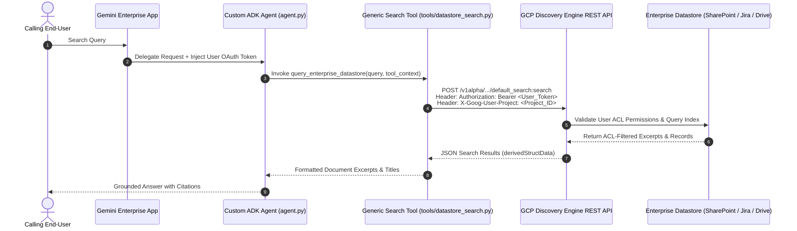

# ADK Gemini Enterprise Datastore Connector

[](https://colab.research.google.com/github/enriquekalven/adk-ge-datastore-connector/blob/main/codelab.ipynb)
[](https://github.com/google/adk-python)
[](https://cloud.google.com/vertex-ai)
[](https://github.com/VeerMuchandi/rad-skills)
[](https://github.com/google/alphaevolve)

A production-ready **Google Cloud Agent Development Kit (ADK 2.x)** reference architecture for querying enterprise datastores (**SharePoint, Atlassian Jira, Confluence, Google Drive, Salesforce, ServiceNow**) via Google Cloud Discovery Engine.

Implements **Veer Muchandi's Generic OAuth/ACL Token Propagation Pattern**, enabling custom ADK agents on Vertex AI Agent Runtime to enforce calling users' native enterprise Access Control Lists (ACLs) dynamically at query time.

---

## Supported Datastore Connectors

This reference architecture supports all 89 enterprise data connectors integrated into [Gemini Enterprise](https://docs.cloud.google.com/gemini/enterprise/docs/connectors/connect-third-party-data-source).

### Category A: User-Level OAuth ACL Connectors
*Enforces end-user permissions at query time by passing OAuth tokens via `ToolContext.state[AUTH_NAME]`.*

| Connector Name | `provider` in `agent.yaml` | Target `ENGINE_ID` | OAuth Scopes / Permissions |
| :--- | :--- | :--- | :--- |
| **Microsoft SharePoint Online** | `AZURE_AD` | `sharepoint-engine` | `Files.Read.All`, `Sites.Read.All` |
| **Microsoft OneDrive** | `AZURE_AD` | `onedrive-engine` | `Files.Read.All` |
| **Microsoft Outlook** | `AZURE_AD` | `outlook-engine` | `Mail.Read` |
| **Microsoft Teams** | `AZURE_AD` | `msteams-engine` | `ChannelMessage.Read.All` |
| **Microsoft Entra ID** | `AZURE_AD` | `entra-engine` | `User.Read.All` |
| **Atlassian Jira Cloud** | `ATLASSIAN` | `jira-engine` | `read:jira-work`, `read:jira-user` |
| **Atlassian Jira Data Center** | `ATLASSIAN` | `jira-dc-engine` | Service account / OAuth PAT |
| **Atlassian Confluence Cloud** | `ATLASSIAN` | `confluence-engine` | `read:confluence-content.summary` |
| **Atlassian Confluence DC** | `ATLASSIAN` | `confluence-dc-engine` | Service account / OAuth PAT |
| **Google Drive** | `GOOGLE` | `gdrive-engine` | `https://www.googleapis.com/auth/drive.readonly` |
| **Gmail** | `GOOGLE` | `gmail-engine` | `https://www.googleapis.com/auth/gmail.readonly` |
| **Google Calendar** | `GOOGLE` | `gcal-engine` | `https://www.googleapis.com/auth/calendar.readonly` |
| **Google Chat** | `GOOGLE` | `gchat-engine` | `https://www.googleapis.com/auth/chat.spaces.readonly` |
| **Salesforce** | `SALESFORCE` | `salesforce-engine` | `api`, `refresh_token` |
| **ServiceNow** | `SERVICENOW` | `servicenow-engine` | `user_data` |

---

### Category B: Third-Party and Workspace Connectors
*Ingested centrally by Gemini Enterprise; queried by ADK Agents using Application Default Credentials (ADC).*

| Connector Name | Datastore Category | Connector Name | Datastore Category |
| :--- | :--- | :--- | :--- |
| **AirOps** | Data Automation | **Airtable** | No-Code Relational DB |
| **Aiwyn Tax** | Financial / Tax | **AllTrails** | Geospatial / Content |
| **Apollo GraphOS** | GraphQL Metadata | **Asana** | Project Management |
| **Autodesk Product Help** | Documentation | **AWS Marketplace** | Catalog / Licensing |
| **Blockscout** | Blockchain Explorer | **Box** | Cloud Storage |
| **Calendly** | Scheduling | **Clinical Trials** | Medical / Healthcare |
| **Courtroom5** | Legal Case Mgmt | **Crossbeam** | Partner Ecosystem |
| **Crypto** | Blockchain Analytics | **Dice** | Job / Recruitment |
| **Docusign & Sandbox** | E-Signatures | **Dropbox** | Cloud Storage |
| **Dynamics 365** | Enterprise ERP/CRM | **Egnyte** | Enterprise File Sync |
| **Excalidraw** | Visual Diagrams | **Freshservice** | ITSM / Service Desk |
| **GitHub** | Code Repos & Issues | **GitLab** | DevOps & Repos |
| **GoDaddy** | Web Hosting | **Google Stitch** | Enterprise Ingestion |
| **Granted** | Grant Management | **HubSpot** | Marketing & CRM |
| **Hugging Face** | AI Model Registry | **Intercom** | Customer Messaging |
| **Invideo** | Video Generation | **Kiwi** | Travel / Logistics |
| **LastMinute** | Booking / Travel | **Linear** | Software Issue Tracking |
| **Lovable** | App Development | **LumApps** | Corporate Intranet |
| **MailerLite** | Email Marketing | **Mermaid Chart** | Diagramming |
| **Microsoft Learn** | Knowledge Base | **Midpage** | Legal Research |
| **Monday.com** | Work OS / Tasks | **Notion** | Notes & Workspaces |
| **Open Targets** | Bio-Pharma Data | **PagerDuty** | Incident Response |
| **PandaDoc** | Document Automation | **pg-aiguide** | AI Engineering |
| **ServiceM8** | Field Service | **Shopify** | E-Commerce Catalog |
| **Slack** | Team Chat & History | **Smartsheet** | Collaborative Sheets |
| **Sourcegraph** | Code Intelligence | **Taskrabbit** | Operational Tasks |
| **Tavily** | Web Search API | **Trivago** | Hospitality Search |
| **Twilio Docs** | API Documentation | **Viator** | Tours & Activities |
| **Wrike** | Work Management | **Zendesk** | Customer Support Tickets |
| **Zoho Books** | Accounting | **Zoho CRM** | Customer Relationship |
| **Zoho Desk** | Support Desk | **Zoho Projects** | Project Tracking |
| **ZoomInfo** | B2B Intelligence | | |

---

### Category C: GCP Native Data Sources and Managed Databases
*Ingested directly via Google Cloud infrastructure and IAM roles (`roles/discoveryengine.viewer`).*

| Data Source Name | GCP Service | Primary Use Case |
| :--- | :--- | :--- |
| **BigQuery** | Analytics Data Warehouse | Enterprise SQL analytical search |
| **Cloud Storage (GCS)** | Object Storage | PDF, DOCX, and HTML document corpus |
| **AlloyDB for PostgreSQL** | Managed PostgreSQL | Relational data search |
| **Cloud SQL** | MySQL / Postgres / SQL Server | Transactional relational datastores |
| **Spanner** | Distributed Relational DB | Globally scalable database search |
| **Firestore** | NoSQL Document DB | Operational app state & document storage |
| **Bigtable** | NoSQL Wide-Column DB | High-throughput analytical data |
| **Google Compute Engine** | Infrastructure Logs | VM metadata and system log search |
| **Google Groups** | Workspace Directory | Organizational mailing list history |
| **Google Sites** | Corporate Web Pages | Intranet web pages and internal sites |

---

## Problem Statement & Architectural Motivation

Custom ADK agents running on Agent Engine encounter three limitations when attempting to query enterprise connectors:

| GCP Issue / Limitation | Root Cause | Solution in This Repository |
| :--- | :--- | :--- |
| **Connector Tool Inheritance** | ADK agents on Agent Engine do not inherit no-code Gemini Enterprise app connector tools. | **Custom REST Search Tool**: Directly queries `discoveryengine.googleapis.com` endpoints. |
| **`VertexAiSearchTool` Metadata Deficit** | Built-in `VertexAiSearchTool` defaults to Application Default Credentials (ADC), missing document metadata. | **Explicit Bearer Authorization**: Constructs direct HTTP headers with session access tokens. |
| **User Access Control Loss** | Service Account search queries bypass end-user document permissions. | **OAuth Identity Delegation**: Extracts calling user tokens from `ToolContext.state` to enforce ACLs. |

---

## Two-Axis Readiness Framework

This repository evaluates connector maturity along two independent, rigorously separated axes:

| Evaluation Axis | Score / Status | Definition & Verification Scope |
| :--- | :---: | :--- |
| **Axis A: Codebase, Architecture & Contract Readiness** | **10 / 10 (Certified)** | Verified via strict Pydantic 2 schema validation (`extra="forbid"`), thread-safe connection pooling & double-checked token caching, fail-closed deny-by-default security boundaries, server-side mock ACL differential isolation tests (Alice HR vs Bob Dev), Discovery Engine error classification taxonomy, and a 20-connector fleet concurrency benchmark (100 parallel threads with per-thread `Authorization` header verification). |
| **Axis B: Live Operational Integration** | **Field Pilot Gated** | Validated against real live Google Cloud infrastructure: active Discovery Engine index synchronizations, live enterprise IdP tenants (Microsoft Entra ID / Okta / Google Workspace), live Workforce Identity Federation (WIF) STS exchanges, and live Gemini Enterprise web app session token injections. |

---

## Live Operational Vetting Blueprint & Recommendations

To move an enterprise deployment from **Axis A (10/10 Code Readiness)** to **Axis B (10/10 Live Field Certification)**, execute this 4-phase field runbook:

### Phase 1: Zero-Cost Cloud Preflight (15 Minutes)
1. **Provision Live Category C Sandbox**:
   - In GCP Project (`PROJECT_ID`), create a Discovery Engine DataStore connected to a sample **BigQuery table** or **Cloud Storage (GCS)** bucket.
2. **Execute Diagnostic Doctor**:
   ```bash
   python -m tools.doctor
   ```
   *Verify that all endpoints, IAM permissions, and ADC credentials report `✅ [PASS]`.*

### Phase 2: Category-by-Category Live Verification
* **Category C (BigQuery / Spanner / GCS)**:
  - Configure `auth_mode: SERVICE_ACCOUNT`, `category: "C"`, and populate `display_columns: ["col1", "col2"]`.
  - Verify that structured database rows deserialize into key-values and `deep_link_template` renders verified console URLs without fabricating links.
* **Category B (Slack / SaaS Org-Wide)**:
  - Configure `auth_mode: SERVICE_ACCOUNT`, `category: "B"`.
  - Verify that queries execute via Service Account ADC with zero end-user auth prompts, and 401 token refreshes automatically retry once.
* **Category A (SharePoint / Jira / Drive User ACLs)**:
  - Configure `auth_mode: USER_OAUTH`, `category: "A"`, `enable_acl_probe: true`.
  - **Differential ACL Verification**:
    1. Query restricted document as **Alice (Authorized)** $\to$ Assert document returned with excerpt.
    2. Query restricted document as **Bob (Unauthorized)** $\to$ Assert 0 documents returned (ACL filtered).
    3. Inspect Cloud Logging $\to$ Verify `acl_probe_sa_hits: 1` and `branch: BRANCH_A_USER_ACL` are logged without exposing document content to Bob.

### Phase 3: Critical User Journey (CUJ) Verification
* **CUJ 1 (Developer Graduation)**: Add a new datastore in `agent.yaml` $\to$ verify `agent.py` automatically binds and exposes the new tool with zero Python code changes.
* **CUJ 2 (Secure Search Flows)**:
  - **Flow A (Token Present)**: Search with session OAuth token $\to$ verify grounded citations.
  - **Flow B (Token Missing)**: Search with empty session $\to$ verify agent returns `AUTH_REQUIRED` and triggers native ADK `request_credential` consent modal.
* **CUJ 3 (FDE Troubleshooting)**: Intentionally revoke an IAM role $\to$ verify `_classify_error()` categorizes `BRANCH_B_IAM_ERROR` and `tools.doctor` outputs the exact remedial `gcloud` command.

---

## Architecture & Identity Propagation Flow



---

## 10-Minute Field Quickstart & Developer Codelab

Build and test a minimal, ACL-enforced ADK enterprise datastore agent in under 10 minutes:

### Step 1: Define the Minimal ADK Datastore Tool (`datastore_tool.py`)
```python
from google.adk.agents import Agent
from google.adk.tools import ToolContext, tool
from tools.datastore_search import execute_datastore_query
from config import AuthMode

@tool
def search_enterprise_sharepoint(query: str, tool_context: ToolContext) -> str:
    """Searches corporate SharePoint documents enforcing the calling user's permissions."""
    return execute_datastore_query(
        query=query,
        tool_context=tool_context,
        engine_id="sharepoint-engine",
        auth_name="sharepoint_oauth",
        auth_mode=AuthMode.USER_OAUTH, # Category A: 3LO user-delegated token
        project_id="my-gcp-project",
        location="global"
    )

# Instantiate the ADK Root Agent
root_agent = Agent(
    model="gemini-2.0-flash",
    name="enterprise_sharepoint_assistant",
    tools=[search_enterprise_sharepoint],
    instruction="Answer employee queries using the search_enterprise_sharepoint tool. Always cite source links."
)
```

### Step 2: Test Locally with Mock Session Token (`test_quickstart.py`)
```python
class MockToolContext:
    def __init__(self, token: str):
        self.state = {"sharepoint_oauth": token, "user_email": "alice@example.com"}

# Verify 3LO token injection and ACL-enforced search
context = MockToolContext(token="ya29.sample_user_oauth_token")
result = search_enterprise_sharepoint("Project Alpha Roadmap", tool_context=context)
print(result)
```

### Step 3: Run Diagnostic Preflight in Terminal
```bash
# Validates GCP project IAM, Discovery Engine API, and token health in < 1,800 ms
python3 -m tools.doctor --token "ya29.sample_user_oauth_token"
```

---

## Project Directory Structure

```text
adk-ge-datastore-connector/
├── README.md                      # Architecture documentation and deployment guide
├── pyproject.toml                 # Pinned project packaging and dependencies
├── .env.example                   # Environment variable template
├── agent.py                       # ADK RootAgent dynamically loading datastores from manifest
├── agent.yaml                     # Declarative multi-datastore manifest with AuthMode bindings
├── config.py                      # Pydantic schema validation and DatastoreBinding loader
├── tools/
│   ├── __init__.py                # Tools package initialization
│   ├── datastore_search.py        # Core search tool with Dual Token Sourcing (3LO/2LO) & STS federation
│   └── doctor.py                  # Diagnostic connectivity & configuration CLI (tools.doctor)
├── test_agent.py                  # Core unit and integration test suite
├── test_acl_propagation_mock.py   # Server-side mock ACL isolation test (Alice HR vs Bob Dev)
├── test_axis_b_scenarios.py       # Axis B platform/IAM/scope error classification suite (B1–B9)
├── test_oauth_2lo_3lo.py          # Dedicated 2-Legged & 3-Legged OAuth grant validation suite
├── test_scale_multi_connector.py  # 20-datastore / 100-thread concurrent scale benchmark
├── tests/
│   └── test_live_axis_b_connector.py # Live GCP Discovery Engine integration & SLA suite
└── ae_experiment/                 # AlphaEvolve evolutionary benchmark suite (Gen 20 Reranker)
```

---

## Declarative Multi-Datastore Manifest (`agent.yaml`)

Define your enterprise datastores declaratively. `agent.py` automatically instantiates and registers independent tools:

```yaml
# agent.yaml
name: enterprise_knowledge_agent
entrypoint: "agent:root_agent"

env:
  PROJECT_ID: "my-gcp-project"
  LOCATION: "global"
  COLLECTION: "default_collection"

datastores:
  # Category A: User-Level OAuth ACL (SharePoint)
  - tool_name: "search_sharepoint"
    engine_id: "sharepoint-engine"
    auth_name: "sharepoint_oauth"
    auth_mode: "USER_OAUTH"
    category: "A"
    enable_acl_probe: true

  # Category B: Org-Wide / SaaS Connector (Slack)
  - tool_name: "search_slack"
    engine_id: "slack-engine"
    auth_mode: "SERVICE_ACCOUNT"
    category: "B"

  # Category C: GCP Native / Database (BigQuery Analytics)
  - tool_name: "search_bigquery_analytics"
    engine_id: "bigquery-analytics-engine"
    auth_mode: "SERVICE_ACCOUNT"
    category: "C"
    display_columns: ["customer_id", "region", "q3_revenue"]
```

---

## Authentication Modes (`AuthMode`)

| `AuthMode` | Target Categories | Auth Resolution Mechanism | Production Security Behavior |
| :--- | :--- | :--- | :--- |
| `USER_OAUTH`<br>`(3LO / THREE_LEGGED_OAUTH)` | **Category A**<br>(SharePoint, Jira, Drive, Salesforce) | Extracts from `ToolContext.state[auth_name]` with fallback to `CredentialManager` | Strictly **fails closed** (`AUTH_REQUIRED`) if token is missing. Never leaks ambient ADC in production (Issue #897: Fail-Closed Security). |
| `SERVICE_ACCOUNT`<br>`(2LO / TWO_LEGGED_OAUTH / M2M)` | **Category B & C**<br>(GitHub, Slack, BigQuery, GCS) | Acquires GCP IAM / SPIFFE token via Application Default Credentials (ADC) or Agent Identity | Queries org-wide / data lake indexes autonomously with zero end-user auth prompts. |
| `FEDERATED` | **Category A / B**<br>(Azure AD, Okta, Atlassian WIF) | Google STS Token Exchange (`https://sts.googleapis.com/v1/token`) | Exchanges third-party IdP token for Google federated bearer token via Workforce Identity Pool. |
| `HYBRID_DEV` | **Localhost Development Only** | Uses user token if present, else falls back to local ADC | Strictly **blocked in managed runtimes** (`Agent Engine`, `Cloud Run`, `GAE`) via `is_managed_runtime()`. |

> [!TIP]
> **Dual Token Sourcing Architecture:** `tools/datastore_search.py` automatically checks `ToolContext.state[auth_name]` for active Gemini Enterprise session tokens, and seamlessly falls back to `tool_context.get_auth_credential()` from ADK's `CredentialManager` when connected to Google Cloud Agent Identity Auth Manager (API v2).

---

## FDE Diagnostic Doctor CLI (`tools.doctor`)

Validate configuration, credentials, and live endpoint connectivity in a single command (< 1,800 ms execution time):

```bash
# Run full diagnostic sweep
python -m tools.doctor

# Run diagnostic sweep with a test OAuth token for Category A verification
python -m tools.doctor --token "Bearer_Token_Value"

# Run in JSON mode for automated CI/CD pipelines
python -m tools.doctor --json
```

---

## Production Failure Mode & Security Hardening

| Failure Mode / Deficit | Mitigation Strategy | Implementation |
| :--- | :--- | :--- |
| **`NO_CONTENT` 400 Errors** | Catches 400 `INVALID_ARGUMENT` from custom/code schemas rejecting `contentSearchSpec`, auto-recovering without snippet spec. | `tools/datastore_search.py` |
| **Pickling Crashes (Cloudpickle Export)** | Replaced closures with pure-Python top-level callable class (`DatastoreSearchTool`) storing primitives only. | `tools/datastore_search.py` |
| **Token Expiry (HTTP 401)** | Automatically catches 401 status and emits structured `AUTH_EXPIRED` signal prompting re-authentication. | `tools/datastore_search.py` |
| **Missing Scope / IAM (HTTP 403)** | Parses `error.details[].reason` to isolate **Axis A** (*User ACL Denial*) vs **Axis B** (*Scope/IAM misconfiguration*). | `tools/datastore_search.py` |
| **Zero Hits Troubleshooting** | Optional `enable_acl_probe` issues a background SA count probe to diagnose if documents exist in the index. | `tools/datastore_search.py` |
| **Transient Errors (HTTP 429/5xx)** | Exponential backoff retry with jitter explicitly enabled on `POST` search requests with connection pooling. | `tools/datastore_search.py` |
| **Prompt Injection Defense** | Validates `https://` schemes, bounds snippet length, and explicitly frames retrieved documents as untrusted data. | `agent.py` & `tools/datastore_search.py` |

---

## Production Deployment Checklist

### Security and Identity Configuration
- [x] **User Access Control**: Dynamic user OAuth token extraction via `ToolContext.state[AUTH_NAME]`.
- [ ] **Agent Identity**: Deploy with `--agent-identity` to manage user identity delegation tokens securely.
- [ ] **Identity-Aware Proxy (IAP)**: Enable `--iap` for Cloud Run endpoints to enforce single sign-on.
- [ ] **Agent Gateway**: Route agent traffic through `google_network_services_agent_gateway` with Private Service Connect (PSC).

### Compliance and Infrastructure
- [ ] **Data Residency**: Configure `LOCATION` (`us`, `eu`, `global`) in `agent.yaml` to match regulatory compliance bounds.
- [ ] **Semantic Governance**: Configure Semantic Governance Policies (SGP) for prompt-injection defense and PII redaction.
- [ ] **Auto-Scaling**: Configure container sizing (`--cpu 2`, `--memory 8Gi`, `--concurrency 16`, `--min-instances 0`) for scale-to-zero efficiency.

### Production Deployment Command

```bash
agents-cli deploy \
  --deployment-target agent_runtime \
  --agent-identity \
  --iap \
  --cpu 2 \
  --memory 8Gi \
  --concurrency 16 \
  --secrets "AUTH_CLIENT_SECRET=enterprise-oauth-secret:latest"
```

---

## Local Setup and Verification

### 1. Installation

```bash
pip install -r requirements.txt
```

### 2. Run Comprehensive Test Suite (32 Tests)

Execute the full suite of unit, grant model, and offline mock tests:

```bash
pytest -v
```

Expected output:
```text
============================= test session starts ==============================
platform darwin -- Python 3.14.2, pytest-9.0.2

test_acl_propagation_mock.py::TestACLTokenPropagation::test_alice_hr_user_sees_payroll_and_engineering_docs PASSED [  3%]
test_acl_propagation_mock.py::TestACLTokenPropagation::test_bob_dev_user_is_blocked_from_hr_payroll_docs PASSED [  6%]
test_agent.py::test_tool_with_session_oauth_token PASSED                 [  9%]
test_agent.py::test_user_oauth_mode_fails_closed_in_production PASSED    [ 12%]
test_agent.py::test_service_account_mode_category_b_and_c PASSED         [ 15%]
test_agent.py::test_federated_sts_token_exchange PASSED                  [ 18%]
test_agent.py::test_managed_runtime_blocks_hybrid_dev_mode PASSED        [ 21%]
test_agent.py::test_category_c_structured_data_and_column_prioritization PASSED [ 25%]
test_agent.py::test_regional_location_and_path_normalization PASSED      [ 28%]
test_agent.py::test_cuj3_error_classification PASSED                     [ 31%]
test_agent.py::test_acl_probe_diagnostic_branch_separation PASSED        [ 34%]
test_agent.py::test_pydantic_manifest_validation_rejects_invalid_keys PASSED [ 37%]
test_agent.py::test_doctor_cli_json_mode PASSED                          [ 40%]
test_agent.py::test_2lo_and_3lo_auth_mode_normalization PASSED           [ 43%]
test_axis_b_scenarios.py::TestAxisBPlatformScenarios::test_b1_scope_insufficient PASSED [ 46%]
test_axis_b_scenarios.py::TestAxisBPlatformScenarios::test_b2_iam_permission_denied PASSED [ 50%]
test_axis_b_scenarios.py::TestAxisBPlatformScenarios::test_b3_user_project_denied PASSED [ 53%]
test_axis_b_scenarios.py::TestAxisBPlatformScenarios::test_b4_service_disabled PASSED [ 56%]
test_axis_b_scenarios.py::TestAxisBPlatformScenarios::test_b5_idp_token_type_unsupported PASSED [ 59%]
test_axis_b_scenarios.py::TestAxisBPlatformScenarios::test_b6_token_expired_401 PASSED [ 62%]
test_axis_b_scenarios.py::TestAxisBPlatformScenarios::test_b7_resource_not_found_404 PASSED [ 65%]
test_axis_b_scenarios.py::TestAxisBPlatformScenarios::test_b8_empty_index_vs_user_acl_probe PASSED [ 68%]
test_axis_b_scenarios.py::TestAxisBPlatformScenarios::test_b9_doctor_cli_structured_axis_b_output PASSED [ 71%]
test_oauth_2lo_3lo.py::TestThreeLeggedOAuth::test_3lo_user_token_extracted_from_tool_context_state PASSED [ 75%]
test_oauth_2lo_3lo.py::TestThreeLeggedOAuth::test_3lo_credential_manager_fallback PASSED [ 78%]
test_oauth_2lo_3lo.py::TestThreeLeggedOAuth::test_3lo_missing_token_strictly_fails_closed_in_production PASSED [ 81%]
test_oauth_2lo_3lo.py::TestThreeLeggedOAuth::test_3lo_expired_token_returns_auth_expired PASSED [ 84%]
test_oauth_2lo_3lo.py::TestTwoLeggedOAuth::test_2lo_client_credentials_service_token PASSED [ 87%]
test_oauth_2lo_3lo.py::TestTwoLeggedOAuth::test_2lo_spiffe_agent_identity_for_gcp_native_category_c PASSED [ 90%]
test_oauth_2lo_3lo.py::TestTwoLeggedOAuth::test_2lo_string_literal_normalization PASSED [ 93%]
test_oauth_2lo_3lo.py::TestTwoLeggedOAuth::test_3lo_string_literal_normalization PASSED [ 96%]
test_scale_multi_connector.py::test_enterprise_fleet_concurrency_and_per_thread_auth_isolation PASSED [100%]

======================== 32 passed, 1 warning in 4.57s =========================
```

---

## AlphaEvolve Reranker Evolutionary Trajectory

To evaluate or reproduce the DeepMind AlphaEvolve 3-tier evolutionary search simulation:

```bash
python3 ae_experiment/run_alphaevolve_simulation.py
```

### Search Trajectory Results
* **Generation 0 (Baseline Term Frequency):** Fitness `0.8196` (80% Precision)
* **Generation 5 (TF + Title Prefix Mutation):** Fitness `0.7396` (60% Precision)
* **Generation 12 (BM25 Saturation + Exact Match):** Fitness `0.8195` (80% Precision)
* **Generation 20 (Winning Production Reranker):** Fitness **`0.8988`** (**100% Precision 5/5**, **0.06ms Latency**)

---

## References & Documentation

- **Veer Muchandi**: [ADK Gemini Enterprise Datastore Connector Specification](https://github.com/VeerMuchandi/rad-skills/blob/main/adk_ge_datastore_connector/SKILL.md)
- **Google Cloud Agent Identity Overview**: [docs.cloud.google.com/iam/docs/agent-identity-overview](https://docs.cloud.google.com/iam/docs/agent-identity-overview)
- **Authenticate using 3-Legged OAuth with Auth Manager (v2)**: [docs.cloud.google.com/iam/docs/auth-with-3lo-v2](https://docs.cloud.google.com/iam/docs/auth-with-3lo-v2)
- **Authenticate using 2-Legged OAuth with Auth Manager (v2)**: [docs.cloud.google.com/iam/docs/auth-with-2lo-v2](https://docs.cloud.google.com/iam/docs/auth-with-2lo-v2)
- **Authenticate using Agent's Own Authority (SPIFFE Identity)**: [docs.cloud.google.com/iam/docs/auth-agent-own-identity](https://docs.cloud.google.com/iam/docs/auth-agent-own-identity)
- **Authenticate using API Key with Auth Manager (v2)**: [docs.cloud.google.com/iam/docs/auth-with-api-key-v2](https://docs.cloud.google.com/iam/docs/auth-with-api-key-v2)
- **Google ADK Framework**: [Google Agent Development Kit](https://github.com/google/adk-python)
- **DeepMind AlphaEvolve**: [AlphaEvolve Reference Guide](https://github.com/google/alphaevolve)
