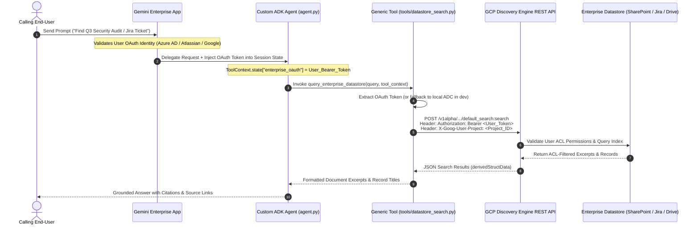

# 🔐 ADK Gemini Enterprise Datastore Connector

[](https://github.com/google/adk-python)
[](https://cloud.google.com/vertex-ai)
[](https://github.com/VeerMuchandi/rad-skills)
[](https://github.com/google/alphaevolve)

A universal, production-ready **Google Cloud Agent Development Kit (ADK 2.x)** reference architecture for securely querying enterprise datastores (**SharePoint, Atlassian Jira, Confluence, Google Drive, Salesforce, ServiceNow**) via Google Cloud Discovery Engine.

This repository implements **Veer Muchandi's Generic OAuth/ACL Token Propagation Pattern**, enabling custom high-code ADK agents to inherit and enforce calling users' native enterprise Access Control Lists (ACLs) dynamically at query time.

---

## 🗺️ Enterprise Datastore Provider Matrix

| Enterprise Datastore | `provider` in `agent.yaml` | Target `ENGINE_ID` | Primary Scopes / Credentials |
| :--- | :--- | :--- | :--- |
| **Microsoft SharePoint Online** | `AZURE_AD` | `sharepoint-engine` | `Files.Read.All`, `Sites.Read.All` |
| **Microsoft OneDrive** | `AZURE_AD` | `onedrive-engine` | `Files.Read.All` |
| **Microsoft Outlook** | `AZURE_AD` | `outlook-engine` | `Mail.Read` |
| **Microsoft Teams** | `AZURE_AD` | `msteams-engine` | `ChannelMessage.Read.All` |
| **Atlassian Jira Cloud / DC** | `ATLASSIAN` | `jira-engine` | `read:jira-work`, `read:jira-user` |
| **Atlassian Confluence Cloud / DC** | `ATLASSIAN` | `confluence-engine` | `read:confluence-content.summary` |
| **Google Drive / Workspace** | `GOOGLE` | `gdrive-engine` | `https://www.googleapis.com/auth/drive.readonly` |
| **Salesforce** | `SALESFORCE` | `salesforce-engine` | `api`, `refresh_token` |
| **ServiceNow** | `SERVICENOW` | `servicenow-engine` | `user_data` |
| **Zendesk** | `ZENDESK` | `zendesk-engine` | `read` |
| **GitHub / GitLab** | `GITHUB` / `GITLAB` | `github-engine` | `repo`, `read:user` |
| **Slack** | `SLACK` | `slack-engine` | `channels:history`, `groups:history` |
| **Box / Dropbox** | `BOX` / `DROPBOX` | `box-engine` | `root_readwrite` / `files.metadata.read` |
| **Notion** | `NOTION` | `notion-engine` | `responses.read` |

---

## 🛑 The Problem: Why This Repository Exists

When building custom high-code AI agents on Google Cloud Vertex AI / Gemini Enterprise, developers encounter three major architectural blockers:

| GCP Blocker / Issue ID | Problem Description | Solution in This Repository |
| :--- | :--- | :--- |
| **The "Connector Wall"<br>`(GCP Issue #434712760)`** | Custom ADK agents on Agent Engine do not inherit no-code Gemini Enterprise app connector tools automatically. | **Custom Universal REST Tool**: Directly calls `discoveryengine.googleapis.com` API endpoints. |
| **`VertexAiSearchTool` Bugs<br>`(GCP Issues #483989453 & #897)`** | Built-in `VertexAiSearchTool` uses Service Account (ADC) credentials, returning empty metadata for connected datastores. | **Bypasses `VertexAiSearchTool`**: Uses custom Bearer token HTTP authorization headers. |
| **ACL Security Loss** | Service account queries bypass user-level document/ticket permissions, creating security compliance risks. | **Veer Muchandi ACL Pattern**: Extracts user OAuth tokens from `ToolContext.state` to enforce user ACLs. |

---

## 🏗️ Architecture & Identity Propagation Flow



---

## 📂 Directory Layout

```text
adk-ge-datastore-connector/
├── README.md                  # Project documentation & integration guide
├── .gitignore                 # Python bytecode & cache exclusion rules
├── requirements.txt           # Python dependencies (google-adk, google-auth, requests)
├── agent.py                   # Core ADK RootAgent definition & universal prompt
├── agent.yaml                 # Deployment manifest with authorizationConfig & Project Number
├── test_agent.py              # Automated multi-connector test suite
├── tools/
│   ├── __init__.py            # Tools package initializer
│   └── datastore_search.py    # Universal ADK search tool with session OAuth propagation
└── ae_experiment/             # AlphaEvolve Optimization Suite
    ├── initial_program.py     # Seed program containing EVOLVE-BLOCK reranker
    ├── evaluator.py           # 3-Tier Evaluator (Validation, Verification, Evaluation)
    └── benchmark_data.json    # Search query ground-truth benchmark dataset
```

---

## 🧩 How to Use This Repository in Your Own Projects

### **Method 1: Direct Tool Import**
Install via pip:

```bash
pip install git+https://github.com/enriquekalven/adk-ge-datastore-connector.git
```

In your `agent.py`:
```python
from google.adk.agents import Agent
from tools.datastore_search import query_enterprise_datastore

my_agent = Agent(
    name="enterprise_assistant",
    instruction="Search SharePoint, Jira, and Drive securely.",
    tools=[query_enterprise_datastore]
)
```

---

### **Method 2: Scaffold via `agents-cli`**

```bash
agents-cli scaffold create --agent github.com/enriquekalven/adk-ge-datastore-connector@main my_new_agent
```

---

## 🛡️ Production Hardening Matrix

| Blindspot / Risk | Mitigation Strategy | Implementation Location |
| :--- | :--- | :--- |
| **Token Expiry (HTTP 401)** | Catches 401 status and returns a structured `AUTH_EXPIRED` signal prompting the user to refresh session. | `tools/datastore_search.py` & `agent.py` |
| **Non-Blocking HTTP Timeouts** | Explicit connect (`3.05s`) and read (`10s`) timeouts prevent thread pool starvation. | `tools/datastore_search.py` |
| **API Gateway Attribution** | Sends `X-Goog-User-Project: <project_id>` header for GCP quota and billing. | `tools/datastore_search.py` |
| **Multi-Schema JSON Parsing** | Multi-path extraction fallback across `derivedStructData`, `structData`, and `document.name`. | `tools/datastore_search.py` |
| **Reward Hacking Prevention** | AST inspection blocks forbidden modules (`sys`, `os`, `inspect`) during evaluation. | `ae_experiment/evaluator.py` |

---

## 🚀 Quickstart & Verification

### 1. Installation

```bash
pip install -r requirements.txt
```

### 2. Run Automated Verification Test Suite

```bash
python3 test_agent.py
```

Output:
```text
==================================================
   Running Generic ADK Enterprise Datastore Test Suite
==================================================

--- Test 1: Active User OAuth Token Propagation ---
✅ Test 1 PASSED: OAuth Token & X-Goog-User-Project headers sent successfully.

--- Test 2: HTTP 401 Token Expiry Handling ---
✅ Test 2 PASSED: 401 Unauthorized caught and converted to AUTH_EXPIRED signal.

--- Test 3: HTTP Timeout Exception Handling ---
✅ Test 3 PASSED: Connection timeout caught gracefully without crashing.

--- Test 4: Agent Configuration & System Prompt ---
✅ Test 4 PASSED: Agent configuration and prompt rules verified.

🎉 ALL TESTS PASSED SUCCESSFULLY!
```

---

## 🧬 AlphaEvolve Reranker Optimization

To run the DeepMind AlphaEvolve 3-tier evaluation benchmark on search result reranking:

```bash
python3 ae_experiment/evaluator.py --program-dir ae_experiment --output-file /tmp/eval_output.json
```

---

## 📦 Deployment (`agent.yaml`)

Deploy using `google-agents-cli` or Vertex AI Reasoning Engine:

```yaml
name: enterprise_knowledge_agent
display_name: "Generic ACL-Aware Enterprise Knowledge Agent"
version: "1.0.0"
entrypoint: "agent:root_agent"

env:
  PROJECT_ID: "your-gcp-project-id"
  PROJECT_NUMBER: "123456789012"
  LOCATION: "global"
  ENGINE_ID: "enterprise-datastore-engine"
  AUTH_NAME: "enterprise_oauth"

authorizationConfig:
  oauthClient:
    name: "enterprise_oauth"
    provider: "AZURE_AD" # AZURE_AD, ATLASSIAN, GOOGLE, SALESFORCE, etc.
    scopes:
      - "Files.Read.All"
      - "Sites.Read.All"

  stateInjection:
    - targetKey: "enterprise_oauth"
      sourceClaim: "access_token"

  resource: "projects/123456789012/locations/global/authorizations/enterprise-oauth-config"
```

To deploy via `agents-cli`:

```bash
agents-cli deploy --agent-manifest agent.yaml
```

---

## 📜 References & Acknowledgments

- **Veer Muchandi**: [ADK Gemini Enterprise Datastore Connector Specification](https://github.com/VeerMuchandi/rad-skills/blob/main/adk_ge_datastore_connector/SKILL.md)
- **Lukas Geiger**: [Vertex GenAI A2A GE OAuth Reference Architecture](https://github.com/ljogeiger/VertexGenAISamples/tree/main/public/a2a_ge_oauth_example)
- **Google ADK Framework**: [Google Agent Development Kit](https://github.com/google/adk-python)
- **DeepMind AlphaEvolve**: [AlphaEvolve Reference Guide](https://github.com/google/alphaevolve)
