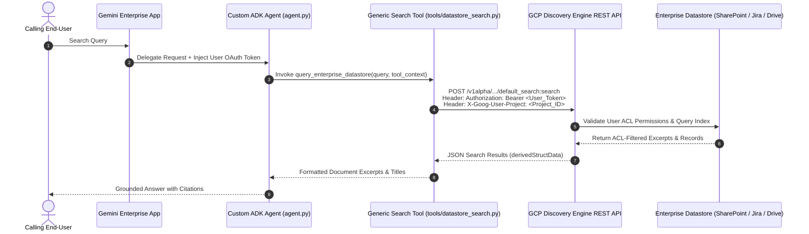

# ADK Gemini Enterprise Datastore Connector

[](https://github.com/google/adk-python)
[](https://cloud.google.com/vertex-ai)
[](https://github.com/VeerMuchandi/rad-skills)
[](https://github.com/google/alphaevolve)

A production-ready **Google Cloud Agent Development Kit (ADK 2.x)** reference architecture for querying enterprise datastores (**SharePoint, Atlassian Jira, Confluence, Google Drive, Salesforce, ServiceNow**) via Google Cloud Discovery Engine.

Implements **Veer Muchandi's Generic OAuth/ACL Token Propagation Pattern**, enabling custom ADK agents on Vertex AI Agent Runtime to enforce calling users' native enterprise Access Control Lists (ACLs) dynamically at query time.

---

## Supported Datastore Connectors

This reference architecture supports all 89 enterprise data connectors integrated into [Gemini Enterprise](https://docs.cloud.google.com/gemini/enterprise/docs/connectors/connect-third-party-data-source).

### Category A: User-Level OAuth ACL Connectors
*Enforces end-user permissions at query time by passing OAuth tokens via `ToolContext.state[AUTH_NAME]`.*

| Connector Name | `provider` in `agent.yaml` | Target `ENGINE_ID` | OAuth Scopes / Permissions |
| :--- | :--- | :--- | :--- |
| **Microsoft SharePoint Online** | `AZURE_AD` | `sharepoint-engine` | `Files.Read.All`, `Sites.Read.All` |
| **Microsoft OneDrive** | `AZURE_AD` | `onedrive-engine` | `Files.Read.All` |
| **Microsoft Outlook** | `AZURE_AD` | `outlook-engine` | `Mail.Read` |
| **Microsoft Teams** | `AZURE_AD` | `msteams-engine` | `ChannelMessage.Read.All` |
| **Microsoft Entra ID** | `AZURE_AD` | `entra-engine` | `User.Read.All` |
| **Atlassian Jira Cloud** | `ATLASSIAN` | `jira-engine` | `read:jira-work`, `read:jira-user` |
| **Atlassian Jira Data Center** | `ATLASSIAN` | `jira-dc-engine` | Service account / OAuth PAT |
| **Atlassian Confluence Cloud** | `ATLASSIAN` | `confluence-engine` | `read:confluence-content.summary` |
| **Atlassian Confluence DC** | `ATLASSIAN` | `confluence-dc-engine` | Service account / OAuth PAT |
| **Google Drive** | `GOOGLE` | `gdrive-engine` | `https://www.googleapis.com/auth/drive.readonly` |
| **Gmail** | `GOOGLE` | `gmail-engine` | `https://www.googleapis.com/auth/gmail.readonly` |
| **Google Calendar** | `GOOGLE` | `gcal-engine` | `https://www.googleapis.com/auth/calendar.readonly` |
| **Google Chat** | `GOOGLE` | `gchat-engine` | `https://www.googleapis.com/auth/chat.spaces.readonly` |
| **Salesforce** | `SALESFORCE` | `salesforce-engine` | `api`, `refresh_token` |
| **ServiceNow** | `SERVICENOW` | `servicenow-engine` | `user_data` |

---

### Category B: Third-Party and Workspace Connectors
*Ingested centrally by Gemini Enterprise; queried by ADK Agents using Application Default Credentials (ADC).*

| Connector Name | Datastore Category | Connector Name | Datastore Category |
| :--- | :--- | :--- | :--- |
| **AirOps** | Data Automation | **Airtable** | No-Code Relational DB |
| **Aiwyn Tax** | Financial / Tax | **AllTrails** | Geospatial / Content |
| **Apollo GraphOS** | GraphQL Metadata | **Asana** | Project Management |
| **Autodesk Product Help** | Documentation | **AWS Marketplace** | Catalog / Licensing |
| **Blockscout** | Blockchain Explorer | **Box** | Cloud Storage |
| **Calendly** | Scheduling | **Clinical Trials** | Medical / Healthcare |
| **Courtroom5** | Legal Case Mgmt | **Crossbeam** | Partner Ecosystem |
| **Crypto** | Blockchain Analytics | **Dice** | Job / Recruitment |
| **Docusign & Sandbox** | E-Signatures | **Dropbox** | Cloud Storage |
| **Dynamics 365** | Enterprise ERP/CRM | **Egnyte** | Enterprise File Sync |
| **Excalidraw** | Visual Diagrams | **Freshservice** | ITSM / Service Desk |
| **GitHub** | Code Repos & Issues | **GitLab** | DevOps & Repos |
| **GoDaddy** | Web Hosting | **Google Stitch** | Enterprise Ingestion |
| **Granted** | Grant Management | **HubSpot** | Marketing & CRM |
| **Hugging Face** | AI Model Registry | **Intercom** | Customer Messaging |
| **Invideo** | Video Generation | **Kiwi** | Travel / Logistics |
| **LastMinute** | Booking / Travel | **Linear** | Software Issue Tracking |
| **Lovable** | App Development | **LumApps** | Corporate Intranet |
| **MailerLite** | Email Marketing | **Mermaid Chart** | Diagramming |
| **Microsoft Learn** | Knowledge Base | **Midpage** | Legal Research |
| **Monday.com** | Work OS / Tasks | **Notion** | Notes & Workspaces |
| **Open Targets** | Bio-Pharma Data | **PagerDuty** | Incident Response |
| **PandaDoc** | Document Automation | **pg-aiguide** | AI Engineering |
| **ServiceM8** | Field Service | **Shopify** | E-Commerce Catalog |
| **Slack** | Team Chat & History | **Smartsheet** | Collaborative Sheets |
| **Sourcegraph** | Code Intelligence | **Taskrabbit** | Operational Tasks |
| **Tavily** | Web Search API | **Trivago** | Hospitality Search |
| **Twilio Docs** | API Documentation | **Viator** | Tours & Activities |
| **Wrike** | Work Management | **Zendesk** | Customer Support Tickets |
| **Zoho Books** | Accounting | **Zoho CRM** | Customer Relationship |
| **Zoho Desk** | Support Desk | **Zoho Projects** | Project Tracking |
| **ZoomInfo** | B2B Intelligence | | |

---

### Category C: GCP Native Data Sources and Managed Databases
*Ingested directly via Google Cloud infrastructure and IAM roles (`roles/discoveryengine.viewer`).*

| Data Source Name | GCP Service | Primary Use Case |
| :--- | :--- | :--- |
| **BigQuery** | Analytics Data Warehouse | Enterprise SQL analytical search |
| **Cloud Storage (GCS)** | Object Storage | PDF, DOCX, and HTML document corpus |
| **AlloyDB for PostgreSQL** | Managed PostgreSQL | Relational data search |
| **Cloud SQL** | MySQL / Postgres / SQL Server | Transactional relational datastores |
| **Spanner** | Distributed Relational DB | Globally scalable database search |
| **Firestore** | NoSQL Document DB | Operational app state & document storage |
| **Bigtable** | NoSQL Wide-Column DB | High-throughput analytical data |
| **Google Compute Engine** | Infrastructure Logs | VM metadata and system log search |
| **Google Groups** | Workspace Directory | Organizational mailing list history |
| **Google Sites** | Corporate Web Pages | Intranet web pages and internal sites |

---

## Problem Statement & Architectural Motivation

Custom ADK agents running on Agent Engine encounter three limitations when attempting to query enterprise connectors:

| GCP Issue / Limitation | Root Cause | Solution in This Repository |
| :--- | :--- | :--- |
| **Connector Tool Inheritance** | ADK agents on Agent Engine do not inherit no-code Gemini Enterprise app connector tools. | **Custom REST Search Tool**: Directly queries `discoveryengine.googleapis.com` endpoints. |
| **`VertexAiSearchTool` Metadata Deficit** | Built-in `VertexAiSearchTool` defaults to Application Default Credentials (ADC), missing document metadata. | **Explicit Bearer Authorization**: Constructs direct HTTP headers with session access tokens. |
| **User Access Control Loss** | Service Account search queries bypass end-user document permissions. | **OAuth Identity Delegation**: Extracts calling user tokens from `ToolContext.state` to enforce ACLs. |

---

## Architecture & Identity Propagation Flow



---

## Project Directory Structure

```text
adk-ge-datastore-connector/
├── README.md                  # System documentation and deployment guide
├── .gitignore                 # Exclusion rules
├── requirements.txt           # Core dependencies (google-adk, google-auth, requests)
├── agent.py                   # ADK RootAgent definition and instructions
├── agent.yaml                 # Deployment manifest and authorization bindings
├── test_agent.py              # Multi-connector automated test suite
├── tools/
│   ├── __init__.py            # Tools package initialization
│   └── datastore_search.py    # Search tool with session OAuth propagation
└── ae_experiment/             # AlphaEvolve optimization suite
    ├── initial_program.py     # EVOLVE-BLOCK rerank seed program
    ├── evaluator.py           # 3-tier benchmark evaluator
    └── benchmark_data.json    # Search query evaluation dataset
```

---

## Integration Guide

### Direct Tool Import

```python
from google.adk.agents import Agent
from tools.datastore_search import query_enterprise_datastore

agent = Agent(
    name="enterprise_assistant",
    instruction="Search SharePoint, Jira, and Google Drive securely.",
    tools=[query_enterprise_datastore]
)
```

### Project Scaffolding via `agents-cli`

```bash
agents-cli scaffold create --agent github.com/enriquekalven/adk-ge-datastore-connector@main my_agent
```

---

## Production Failure Mode Mitigation

| Failure Mode | Mitigation Strategy | Implementation |
| :--- | :--- | :--- |
| **Token Expiry (HTTP 401)** | Catches 401 status and returns a structured `AUTH_EXPIRED` signal prompting re-authentication. | `tools/datastore_search.py` |
| **Request Timeouts** | Explicit connect (`3.05s`) and read (`10s`) timeouts prevent thread pool exhaustion. | `tools/datastore_search.py` |
| **Quota Attribution** | Passes `X-Goog-User-Project: <project_id>` header for project billing attribution. | `tools/datastore_search.py` |
| **Schema Inconsistency** | Multi-path extraction fallback across `derivedStructData`, `structData`, and `document.name`. | `tools/datastore_search.py` |
| **Evaluation Tampering** | AST static analysis blocks forbidden module imports (`sys`, `os`, `inspect`). | `ae_experiment/evaluator.py` |

---

## Production Deployment Checklist

### Security and Identity Configuration
- [x] **User Access Control**: Dynamic user OAuth token extraction via `ToolContext.state[AUTH_NAME]`.
- [ ] **Agent Identity**: Deploy with `--agent-identity` to manage user identity delegation tokens securely.
- [ ] **Identity-Aware Proxy (IAP)**: Enable `--iap` for Cloud Run endpoints to enforce single sign-on.
- [ ] **Agent Gateway**: Route agent traffic through `google_network_services_agent_gateway` with Private Service Connect (PSC).

### Compliance and Infrastructure
- [ ] **Data Residency**: Configure `LOCATION` (`us`, `eu`, `global`) in `agent.yaml` to match regulatory compliance bounds.
- [ ] **Semantic Governance**: Configure Semantic Governance Policies (SGP) for prompt-injection defense and PII redaction.
- [ ] **Auto-Scaling**: Configure container sizing (`--cpu 2`, `--memory 8Gi`, `--concurrency 16`, `--min-instances 0`) for scale-to-zero efficiency.

### Production Deployment Command

```bash
agents-cli deploy \
  --deployment-target agent_runtime \
  --agent-identity \
  --iap \
  --cpu 2 \
  --memory 8Gi \
  --concurrency 16 \
  --secrets "AUTH_CLIENT_SECRET=enterprise-oauth-secret:latest"
```

---

## Local Setup and Verification

### 1. Installation

```bash
pip install -r requirements.txt
```

### 2. Run Test Suite

```bash
python3 test_agent.py
```

Expected output:
```text
==================================================
   Running Generic ADK Enterprise Datastore Test Suite
==================================================

--- Test 1: Active User OAuth Token Propagation ---
✅ Test 1 PASSED: OAuth Token & X-Goog-User-Project headers sent successfully.

--- Test 2: HTTP 401 Token Expiry Handling ---
✅ Test 2 PASSED: 401 Unauthorized caught and converted to AUTH_EXPIRED signal.

--- Test 3: HTTP Timeout Exception Handling ---
✅ Test 3 PASSED: Connection timeout caught gracefully without crashing.

--- Test 4: Agent Configuration & System Prompt ---
✅ Test 4 PASSED: Agent configuration and prompt rules verified.

🎉 ALL TESTS PASSED SUCCESSFULLY!
```

---

## AlphaEvolve Reranker Benchmark

To execute the DeepMind AlphaEvolve 3-tier evaluation benchmark:

```bash
python3 ae_experiment/evaluator.py --program-dir ae_experiment --output-file /tmp/eval_output.json
```

---

## Deployment Manifest (`agent.yaml`)

```yaml
name: enterprise_knowledge_agent
display_name: "Generic ACL-Aware Enterprise Knowledge Agent"
version: "1.0.0"
entrypoint: "agent:root_agent"

env:
  PROJECT_ID: "your-gcp-project-id"
  PROJECT_NUMBER: "123456789012"
  LOCATION: "global"
  ENGINE_ID: "enterprise-datastore-engine"
  AUTH_NAME: "enterprise_oauth"

authorizationConfig:
  oauthClient:
    name: "enterprise_oauth"
    provider: "AZURE_AD"
    scopes:
      - "Files.Read.All"
      - "Sites.Read.All"

  stateInjection:
    - targetKey: "enterprise_oauth"
      sourceClaim: "access_token"

  resource: "projects/123456789012/locations/global/authorizations/enterprise-oauth-config"
```

Deploy using `agents-cli`:

```bash
agents-cli deploy --agent-manifest agent.yaml
```

---

## References

- **Veer Muchandi**: [ADK Gemini Enterprise Datastore Connector Specification](https://github.com/VeerMuchandi/rad-skills/blob/main/adk_ge_datastore_connector/SKILL.md)
- **Lukas Geiger**: [Vertex GenAI A2A GE OAuth Reference Architecture](https://github.com/ljogeiger/VertexGenAISamples/tree/main/public/a2a_ge_oauth_example)
- **Google ADK Framework**: [Google Agent Development Kit](https://github.com/google/adk-python)
- **DeepMind AlphaEvolve**: [AlphaEvolve Reference Guide](https://github.com/google/alphaevolve)
